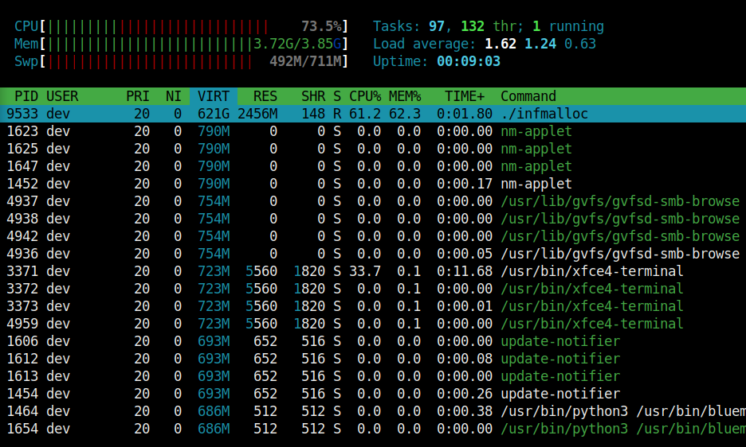

# WI001 - Infinite malloc

What if we tried to allocate infinite memory with `malloc` in C ?

## Proof of Concept

Let's create an infinite loop of memory allocations :

```c
#include <stdlib.h>
#include <stdio.h>

int main(int argc, char const *argv[]) {
    printf("=============== Infinite memory allocator - v1.0.1 ===============\n");
    long long int k = 0;
    while (1) {
        // Creates the zone in memory
        char * mem = malloc(1000000);
        k += 1;
        // Use the zone to prevent bypass by optimization
        mem[0]     = '\0';
        printf("\r[LOG] Allocated %lld", k);
    }
    return 0;
}
```

## Results

With `htop` on the same machine, we can track how much virtual memory we were able to allocate :



This freezes the machine and thus creates a denial of service.

## Explanation

Operating systems uses virtual memory in order to create the illusion to users of a very large memory. Therefore, when there is a shortage of RAM, the OS puts new allocated memory onto the harddisk.

## References
 - https://en.wikipedia.org/wiki/Virtual_memory
 - https://searchstorage.techtarget.com/definition/virtual-memory
 - https://stackoverflow.com/questions/13921053/malloc-inside-an-infinte-loop
